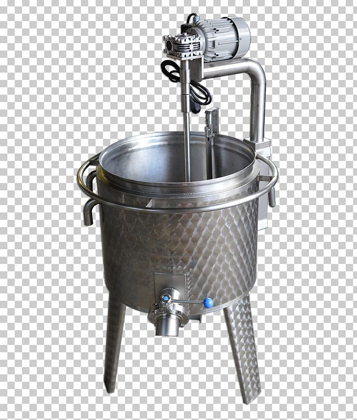
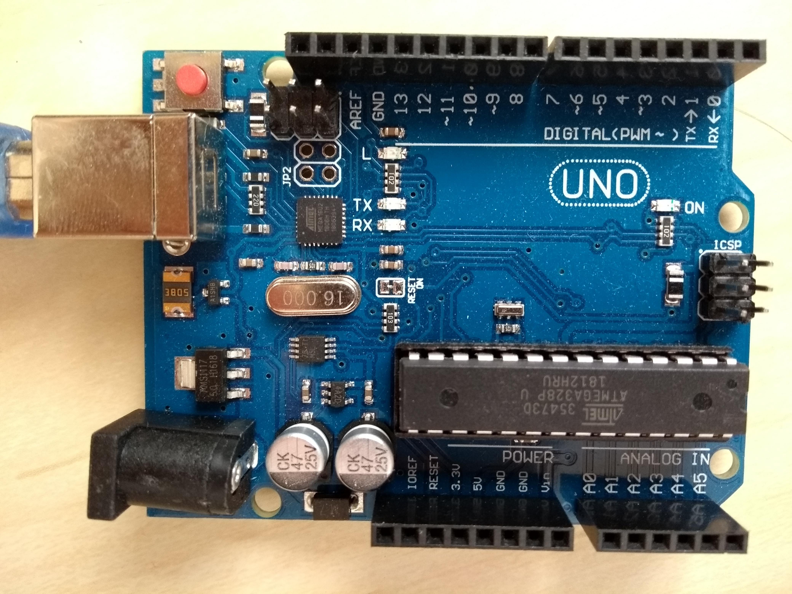
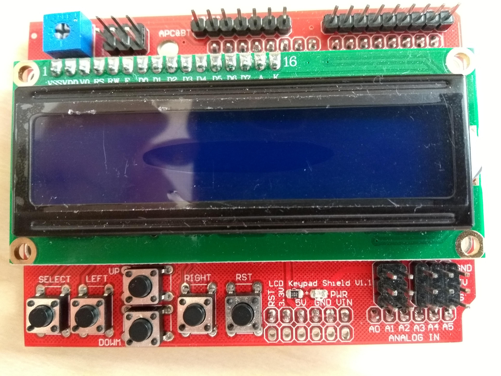

# boiler_control_unit

Arduino control unit for controlling the cheese preparation process in a boiler. The image below shows an example of how such a boiler can look like

The control unit interacts/controls:

- water pump
- heating coil
- stirring motor

As a control unit I used Arduino Uno with 16x2 lcd with integrated buttons (see img below).

